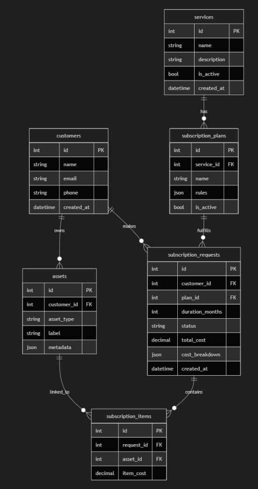

# Dynamic Subscription System

A fully dynamic, configuration-driven subscription engine built with **Python + Flask" or "Python + Flask + SQLAlchemy**.

## Overview
This system allows residential communities to manage subscriptions for any type of service (car washing, gardening, pool cleaning, etc.) without modifying backend code. New services, plans, and pricing strategies are added entirely through the admin dashboard API.

---

## How to Run

```bash
# Create virtual environment
python -m venv venv
source venv/bin/activate  # or venv\Scripts\activate on Windows

# Install dependencies
pip install -r requirements.txt

# Set environment
set FLASK_APP=app:create_app  # Windows
export FLASK_APP=app:create_app  # Linux/Mac

# Init DB (SQLite by default)
flask db init
flask db migrate -m "initial"
flask db upgrade

# Seed demo data
python seed.py

# Run server
flask run
```

Swagger UI available at: **http://localhost:5000/**

---

## Architecture

The system follows Clean Architecture with four distinct layers:

```
API Layer (Flask-RESTX)      → HTTP handling, Swagger docs
    ↓
Service Layer                → Use-case orchestration
    ↓
Domain Layer                 → Rule Engine + Pricing Engine
    ↓
Repository Layer             → Database abstraction (SQLAlchemy)
```

---

## Database Design


Business logic is **completely decoupled from Flask**. The Rule Engine and Pricing Engine can be unit-tested without any framework dependency.

### Key Design Patterns

- **Strategy Pattern** — Pricing calculation (`FixedPricingStrategy`, `PerAssetPricingStrategy`, `PerAreaPricingStrategy`)
- **Factory Pattern** — `PricingEngine` selects the strategy from plan configuration
- **Repository Pattern** — Generic `BaseRepository` with domain-specific extensions
- **App Factory** — Flask application built via `create_app()` for testability

---

## Dynamic Rule Engine

Subscription plans store all business rules as JSON:

```json
{
  "pricing_type": "per_asset",
  "price": 50.0,
  "billing_cycle_months": 1,
  "min_duration_months": 3,
  "payment_type": "prepaid",
  "requires_inspection": true,
  "inspection_fee": 20.0,
  "proration": { "enabled": true, "method": "daily" },
  "applicable_asset_types": ["car"]
}
```

The **RuleEngine** validates requests against these rules. The **PricingEngine** calculates costs using the appropriate strategy. Both are fully data-driven — no hardcoded service names or `if/else` blocks.

---

## How to Add a New Service

1. `POST /dashboard/services` — Create the service record
2. `POST /dashboard/plans` — Create a plan with the rules JSON
3. Done — the mobile API automatically surfaces the new service

---

## Project Structure

```
app/
├── __init__.py          # Flask app factory
├── extensions.py        # SQLAlchemy, Migrate singletons
├── config/settings.py   # Dev / Test / Prod configurations
├── domain/
│   ├── models.py        # 6 generic ORM models
│   ├── pricing_engine.py # Strategy Pattern pricing
│   ├── rule_engine.py   # Data-driven rule validation
│   └── exceptions.py    # Custom exception hierarchy
├── repositories/        # Generic BaseRepository + domain repos
├── services/            # Use-case orchestration classes
├── schemas/             # Pydantic v2 validation
└── api/
    ├── mobile.py        # Resident-facing endpoints
    └── dashboard.py     # Admin endpoints
```

---

## API Endpoints

### Mobile (`/mobile`)

| Method | Endpoint | Description |
|--------|----------|-------------|
| GET | `/mobile/services` | Active services with plans |
| GET | `/mobile/customers/<id>/assets` | Customer assets (filter by type) |
| POST | `/mobile/subscriptions` | Create subscription request |
| GET | `/mobile/subscriptions/<id>` | View request + cost breakdown |

### Dashboard (`/dashboard`)

| Method | Endpoint | Description |
|--------|----------|-------------|
| POST | `/dashboard/services` | Create service |
| PUT | `/dashboard/services/<id>` | Update service |
| GET | `/dashboard/services` | List all services |
| POST | `/dashboard/plans` | Create plan with rules |
| PUT | `/dashboard/plans/<id>` | Update plan + rules |
| GET | `/dashboard/plans` | List plans (filter by service) |
| GET | `/dashboard/subscriptions` | List requests (filter: status, inspection) |
| PATCH | `/dashboard/subscriptions/<id>/status` | Update request status |
| POST | `/dashboard/customers` | Create customer |
| POST | `/dashboard/customers/<id>/assets` | Add asset to customer |

---

## Testing

```bash
pytest tests/ -v --tb=short
```

Test coverage:
- **Pricing Engine** — All 3 strategies, inspection fee, proration, edge cases
- **Rule Engine** — Duration, asset types, billing cycles, multi-violation collection
- **Integration** — Full subscription workflow via API, rule violation handling, dashboard operations

---

## Trade-offs & Decisions

| Decision | Rationale |
|----------|-----------|
| JSON rules column | Maximum flexibility for dynamic configuration without schema migrations |
| Strategy Pattern for pricing | Open/Closed principle — add new pricing types without modifying existing code |
| SQLite fallback | Enables local development without Docker/PostgreSQL |
| Pydantic for validation | Framework-agnostic validation separate from Flask-RESTX Swagger models |
| Simplified 30-day month | Proration uses fixed 30-day months for simplicity; production would use calendar days |

---

## Future Improvements

- Event-driven billing system (subscription renewal, payment notifications)
- Subscription renewal automation with scheduling
- Caching layer for frequently accessed plans
- Admin analytics dashboard (revenue, subscriptions per service)
- JWT authentication for API security
- Rate limiting and request throttling
- Audit logging for plan rule changes
